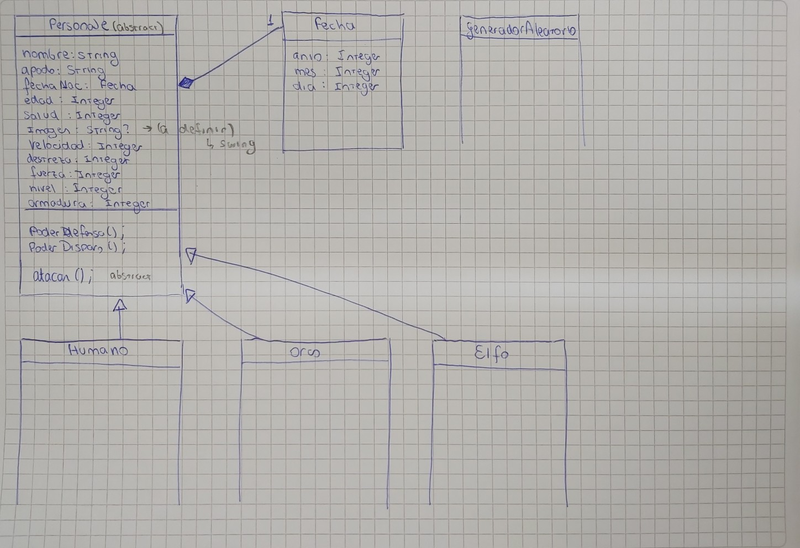

# Trabajo final Programacion III

En este espacio se documentará el progreso del proyecto, desde su concepción y primera ideación, los cambios y su justificación, hasta que se cierre el proyecto. 
---
### Tecnologias a utilizar: 
Está desarrollado en **Java**, e idealmente se realizará una implementación de interfaz gráfica en **Java Swing**. 
El proyecto se inicializó con un arquetipo de **Maven**, para generar una rama donde realizar tests unitarios. 

## Inicios del proyecto
En principio es concebido siguiendo las indicaciones de la consigna provista por el profesor, ni más ni menos. Mientras se avance probablemente se realicen cambios en la distribución de la información/organización de los métodos.

## Primer borrador del UML

En base a este gráfico se comenzaron a crear las clases y la estructura del proyecto. Hay cuestiones que no están definidas al 100%, por lo que no aparecen, o se reflejan en comentarios en la misma imagen. 

